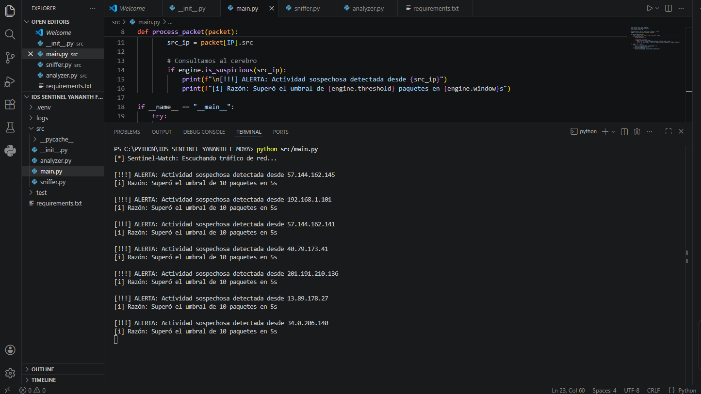

# 🛡️ Sentinel-Watch: Intrusion Detection System (IDS)
**Desarrollado por:** Yananth F. Moya |  **Categoría:** Ciberseguridad Defensiva (Blue Team) 
### 📸 Evidencia de Funcionamiento



## 📖 Descripción Profesional
**Sentinel-Watch** es un motor de detección de intrusos ligero diseñado para el monitoreo pasivo de redes. Como profesional con experiencia en infraestructura de fibra óptica y estudiante de ciberseguridad, desarrollé esta herramienta para cerrar la brecha entre la conectividad física y la seguridad lógica.

El sistema utiliza un **Algoritmo de Umbral Dinámico** para identificar patrones de tráfico que coinciden con técnicas de reconocimiento (Recon) y ataques de fuerza bruta, generando registros de auditoría inmediata.

## 🛠️ Stack Técnico
- **Core:** Python 3.x
- **Análisis de Paquetes:** Scapy (Manipulación de capas 2, 3 y 4 del modelo OSI).
- **Gestión de Datos:** Diccionarios optimizados para seguimiento de estados de IP.
- **Logging:** Sistema de persistencia con protección de buffer para evitar pérdida de evidencia.

## 🏗️ Arquitectura del Sistema
El proyecto sigue un patrón de diseño modular para facilitar la escalabilidad:

1.  **Sniffer Layer (`sniffer.py`):** Intercepta tráfico crudo en la interfaz de red.
2.  **Logic Engine (`analyzer.py`):** Filtra y contabiliza paquetes por origen y ventana de tiempo.
3.  **Alerting System (`alerts.py`):** Gestiona la salida de datos y el almacenamiento forense en `/logs`.

## 🛡️ Casos de Uso Detectados
- **Escaneo de Puertos (TCP Connect):** Identifica cuando una sola IP intenta tocar múltiples puertos en segundos.
- **DoS de Bajo Impacto:** Detecta inundaciones de paquetes que buscan saturar servicios.
- **Reconocimiento de Red:** Monitorea actividad inusual de IPs externas o locales.

## 🚀 Instalación Rápida
```bash
# Clonar repositorio
git clone [https://github.com/tu-usuario/sentinel-watch.git](https://github.com/tu-usuario/sentinel-watch.git)
cd sentinel-watch

# Configurar entorno profesional
python -m venv .venv
source .venv/Scripts/activate  # Windows: .\.venv\Scripts\activate

# Instalar dependencias críticas
pip install -r requirements.txt

# Ejecución (Privilegios de Admin requeridos para acceso a socket crudo)
python src/main.py 

## 📝 Descripción del Proyecto

**Sentinel-Watch** es una solución de monitoreo de seguridad que actúa como la primera línea de defensa en una infraestructura de red. Este proyecto nace de la necesidad de entender cómo fluyen los datos y cómo identificar a un atacante antes de que logre explotar una vulnerabilidad.

### ¿Qué resuelve?
En entornos de red modernos, los escaneos de puertos son el preámbulo de un ataque mayor. Sentinel-Watch detecta esta fase de "Reconocimiento" mediante:
* **Interceptación pasiva:** Escucha el tráfico sin interrumpir la conectividad.
* **Análisis de umbrales:** Diferencia el tráfico legítimo de un escaneo automatizado (Nmap, ZMap).
* **Gestión de incidentes:** Centraliza las alertas en un archivo de log estructurado para su posterior revisión.

